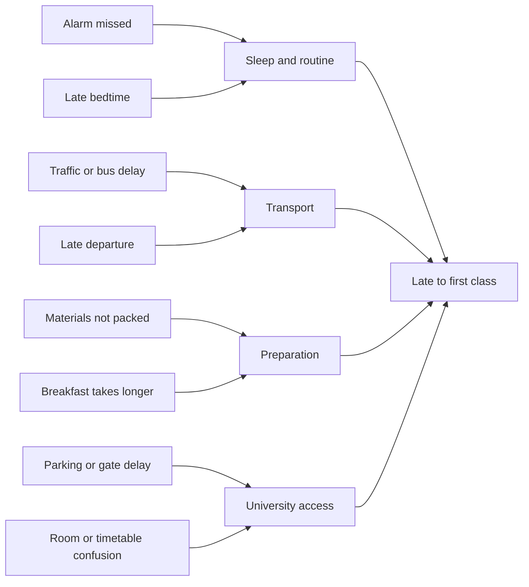

# Chapter 10 understanding and exercise coverage

## Chapter context

Quality is fitness for use and conformance to customer requirements, including reliability, consistency and freedom from defects. It is not equivalent to luxury or price. Inspection separates defective output after production; prevention improves the process so defects do not occur. Relevant costs include inspection, training, process redesign, scrap, rework, warranty, delays and lost customer goodwill.

SPC distinguishes common/random variation from assignable/special-cause variation. Special causes warrant investigation and correction; reducing common variation usually requires changing the system. Shewhart developed control charts, Deming promoted statistical quality management, Juran emphasized the vital few, and Ishikawa diagrams organize potential causes.

The chapter's TransCarolina example shows why means and ranges must be viewed together: a trainee working Fridays creates higher means and ranges. Excluding those days is justified only after the cause is identified. The experienced teller's stable average can still miss the under-60-second performance goal. Golden Guernsey's aggregate underfill rate can appear acceptable while its hourly p chart reveals a daily cycle. TQM combines employee involvement, fishbone cause analysis, Pareto prioritization and continuous improvement. Acceptance sampling controls input quality, with an unavoidable tradeoff among sample cost, producer's risk and consumer's risk.

## Self-check exercises

| Exercise | Project cases | Understanding |
|---|---|---|
| SC10-1 | a-d | Mean-chart control limits from n, grand mean and average range |
| SC10-2 | one case | Tire mean chart; no limit violations, but also inspect variability |
| SC10-3 | a-d | Range-chart control limits, including nonnegative LCL |
| SC10-4 | one case | Tire range chart shows cycling; an all-inside-limits conclusion is insufficient |
| SC10-5 | a-d | Proportion limits; clip impossible bounds to 0 or 1; retain source misprint in (b) |
| SC10-6 | one case | Meals chart; five lower outliers; favorable upper outliers are still statistical signals |
| SC10-7 | one case | Pareto faults; hard drives and power supplies first; Other at end |
| SC10-8 | a-d | Producer risk at AQL .005, binomial rejection tail |
| SC10-9 | a-d | Consumer risk at LTPD .01, binomial acceptance tail |

Printed self-check answers are stored separately from independent references. The chart counts in SC10-7 are source data; the printed chart/text corroborate its leading categories rather than providing a separate printed grand total.

## Regular numerical and chart-design exercises

| Exercise | Project case(s) | Method and interpretation |
|---|---|---|
| 10-12 | a-d | Xbar limits; (a) uses given standard error directly |
| 10-13 | `10-13` | Piston means; batch 11 is below LCL, batches 2 and 12 above UCL |
| 10-14 | `10-14`, `10-14c` | Emergency means; Saturday groups 6,13,20 signal; recalculate after excluding the identified cause |
| 10-15 | `10-15` | Compute means/ranges from 18 raw bearing subgroups; upward mean drift |
| 10-16 | `10-16` | Bracket means; second-shift level is higher; check recalibration |
| 10-17 | a-e | Range limits; (e) infer UCL=9 from positive LCL=3 and Rbar=6 |
| 10-19 | `10-19` | Piston ranges using 10-13 data |
| 10-20 | `10-20`, `10-20c` | Emergency ranges, before/after Saturday removal; inspect weekly range pattern |
| 10-21 | `10-21` | Bearing ranges; stable spread does not eliminate mean drift |
| 10-22 | `10-22` | Bracket ranges; inspect alongside shift changes in means |
| 10-24 | a-e | Proportion limits using given centers/targets |
| 10-25 | `10-25` | Correct luggage fractions; no individual limit violations; still improve incorrect delivery rate |
| 10-26 | `10-26a`, `10-26b` | Aggregate one-sided test and target-centered capsule p chart; inspect repeated cycles |
| 10-27 | `10-27` | Chart design only: CL=.5, LCL=.35, UCL=.65; no supplied observations to plot |
| 10-28 | `10-28` | Late departures; intervention after first ten weekdays; improvement followed by worsening |
| 10-31 | `10-31a`, `10-31b` | Aggregate department counts, then Classified subcategories; instructions errors first |
| 10-32 | `10-32` | Plant complaints; Atlanta and Houston first; counts are not exposure-adjusted rates |
| 10-36 | a-d | Producer risk at AQL .02 |
| 10-37 | a-d | Consumer binomial approximation at LTPD .03 |
| 10-38 | a-c | Read producer risk as 1 minus OC ordinate; use inferred Poisson curve model |
| 10-39 | a-c | Consumer risk equals OC ordinate |
| 10-40 | `10-40a`, `10-40b` | Overall audit test and target p chart; investigate rise toward filing deadline |
| 10-44 | `10-44` | Check-processing mean chart; shift 1 entirely below CL, shift 2 above |
| 10-45 | `10-45` | Range chart from 10-44; compare variability with mean shift |
| 10-46 | `10-46` | Subcontractor Pareto; Wallboard then Electrical; faults are not defective-condo counts |
| 10-47 | a-d | Producer risk at AQL .01 |
| 10-48 | a-d | Consumer approximation at .015; N*p=37.5 means fixed-lot hypergeometric needs an explicit integer D |
| 10-50 | `10-50` | Disk coating mean chart; last-half means vary less; specifications 72-78 are individual-unit requirements |
| 10-51 | `10-51` | Declining ranges reveal reduced variation; sustain the cause and reconsider the baseline |
| 10-52 | `10-52` | Print defect p chart with target .001; all individual observations within limits |
| 10-55 | a-c | Producer risk from n=300,c=3 OC graph |
| 10-56 | a-c | Consumer risk from same OC graph |

The report's interpretation for each case also covers its discussion subparts. Exclusion-case charts retain original group labels. An exercise prefix selects its letter subparts only if an exact case ID is absent; therefore specify `10-14c` separately from `10-14`.

## Conceptual and non-data exercises

These require reasoning, examples or a qualitative diagram, not invented numerical samples. The following are project explanations, not transcribed book answers.

| Exercise | Explanation / suitable response |
|---|---|
| 10-1 | An expensive car that repeatedly fails to start has low fitness for use despite luxury fittings. |
| 10-2 | Inexpensive copier paper with reliable dimensions and feed behavior can have high quality. |
| 10-3 | Quality means fitness for use or conformance to requirements; customer needs determine those requirements. |
| 10-4 | Mass production introduces variation among nominally identical items; failures, waste and customer consequences concern management. |
| 10-5 | Compare inspection/retest labor and equipment, scrap/rework, warranty and returns, lost goodwill, against prevention training, design, maintenance and process-control costs. |
| 10-6 | Zero defects is the goal of doing work correctly at each stage rather than accepting a routine allowance for errors. |
| 10-7 | Competitive pressure from Japanese products in the 1970s/1980s increased US attention to Deming's methods. |
| 10-8 | A robot repeats a controlled motion without human fatigue/attention variation, but it still has mechanical, input and calibration variation. |
| 10-9 | A pitcher change often responds to an identified cause such as fatigue or poor matchup; ordinary random bad luck alone would not establish an assignable cause. Explain the actual evidence. |
| 10-10 | Express lanes separate customers with few items from larger orders, reducing systematic variation in service time from order size. |
| 10-11 | Examples: outlier from wrong setup; increasing trend from tool wear; step change from recalibration; periodic cycle from shift patterns. |
| 10-18 | Choose graph (a): an apprentice's range tends to decrease with practice. This improvement is systematic variation, not a stable random range pattern. The diagram supplies no raw numeric coordinates. |
| 10-23 | French noun gender and Pass/Fail are binary attributes; German noun gender has three grammatical categories and A/B/C/D/F grades have five, so those codings are not binary attributes. |
| 10-29 | Frontline staff understand actual failure mechanisms and must be able to act; management supplies resources, priorities and authority. |
| 10-30 | TQM is continuous: after one leading cause is reduced, another becomes the priority. Returning to business as usual loses improvement. |
| 10-33 | Create a fishbone for arriving late, using personal causes rather than fictitious data. A sample structure is provided below. |
| 10-34 | Whole-lot inspection is costly, time-consuming and sometimes destructive; inspectors can also make errors. |
| 10-35 | c is the maximum number of sample defectives allowed for lot acceptance; accept if X<=c and reject if X>c. |
| 10-41 | Address the vital few causes responsible for the greatest share of problems; consider severity as well as frequency. |
| 10-42 | Currently married/never married has two values; single/married/widowed/divorced has four. The attribute classification concerns the coding, not just the topic. The first coding also omits previously married people unless defined more broadly. |
| 10-43 | Customer item count creates a predictable service-time effect. Stratify by transaction complexity; do not treat that effect as unexplained random noise. Under a mixed-customer process it can contribute to normal variation, but the chapter's concern is the identifiable systematic source. |
| 10-49 | Customers differ, but service processes can reduce avoidable variation in timeliness, reliability and accuracy; use customer groups or case complexity where needed. |
| 10-53 | Producer's risk is analogous to Type I error (reject a good lot); consumer's risk to Type II error (accept a bad lot). |
| 10-54 | Common causes: small flow fluctuations, measurement noise and material variation. Special causes: miscalibrated scales, a blocked feeder or changed machine settings. |
| 10-57 | Plot annual subgroup mean GPA with a mean chart and, if ranges are available, an R chart. Plot A/B grade proportions using total grades as denominators, not simply 200 students. No GPA/grade data are supplied, so numerical charts cannot be honestly generated. |
| 10-58 | Acceptance sampling lowers inspection costs and can avoid destructive full inspection while applying consistent supplier incentives; it leaves residual acceptance/rejection risks. |
| 10-59 | Graduation is binary at student level, so use a p chart of consistently defined cohort graduation proportions. Rates alone are incomplete quality measures and may reflect admission selectivity, preparation and retention policy. |

## Exercise 10-33: example fishbone structure

Replace these candidate causes with your own. A fishbone organizes hypotheses; it does not establish that a cause is true.

For a handwritten portfolio, draw the categories as angled ribs joining the spine toward “Late to first class”; the Mermaid view communicates the same cause-group structure.

## Suggested Part 2B write-up structure

1. Title, course, student details, objective and source chapter.
2. Method: formulas, Appendix Table 9, distribution choices, reproducible seed and trial count.
3. Numerical results: input table, reference provenance, computed answer, tolerance and difference.
4. Simulation verification: theoretical probability/expectation, Monte Carlo estimate, interval/error and assumptions.
5. Charts: outliers, patterns, distinction between limits and specifications, proposed corrective action.
6. Source discrepancies and limitations: missing publisher answers, printed typo, graph precision and independent reference method.
7. Appendix: scripts, JSON input/reference files, dependency versions and run command.

The report is electronic Part 2B evidence. It does not replace the handwritten Parts 1/2A or claim that illustrative software data satisfy the separate micro/macro project requirement.
